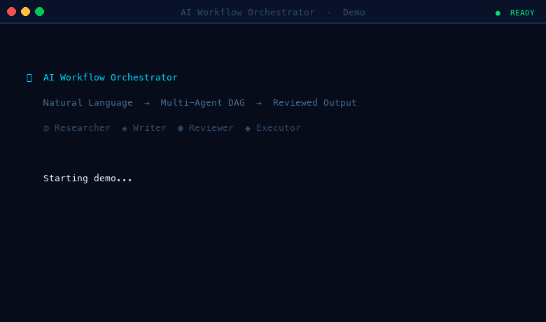

# Weave

> Multi-agent AI workflow orchestration — type a goal, watch specialized agents research, write, review, and deliver it in real time.



---

## Explore the Architecture

> **Start here before anything else.**
>
> Open **`flow.html`** in your browser for a fully interactive diagram of the entire platform.
> No server needed — just double-click the file.
>
> **Two tabs inside:**
> - **🗺 Product Journey** — 21 clickable nodes tracing a request from first login through export. Click any node to see what happens, the user experience, the technical detail, source file references, and connected nodes.
> - **⚙ Technical Architecture** — 5 layered components (Browser → Flask API → Orchestration Core → SQLite → External Services) showing how data flows end-to-end.
>
> Every node and component card is clickable. A detail panel slides in with full context. Pan by dragging, zoom with the controls in the bottom bar.

---

## Quick Start

### Backend

```bash
git clone <repo-url>
cd ai-workflow-orchestrator
cp .env.example .env          # fill in ANTHROPIC_API_KEY + JWT_SECRET
pip install -r requirements.txt
python3 -m backend.api.server  # starts on http://localhost:5000
```

> Without `ANTHROPIC_API_KEY` the server falls back to mock mode automatically — all endpoints work, agents return realistic placeholder output.

### Frontend (separate terminal)

```bash
cd frontend
npm install
npm run dev                   # opens http://localhost:5173
```

The React app connects to `http://localhost:5000`. Sign in with your email — you'll receive a 6-digit OTP. In dev mode (`DEV_MODE=true`) the code is also returned in the API response so you can log in without an email provider.

---

## Features

- **Auth** — Email OTP via Resend, JWT sessions (7-day), admin flag via `ADMIN_EMAIL` env var, `DEV_MODE` returns OTP in response for local testing
- **Workflow Engine** — Natural language → DAG decomposition via Claude, Kahn's topological sort for dependency ordering, cycle detection and validation
- **Parallel Execution** — Independent tasks grouped into waves and run concurrently via `ThreadPoolExecutor(max_workers=8)`
- **Agent Pipeline** — 6 built-in agent types (Researcher, Writer, Analyst, Critic, Planner, Developer), custom agent builder with user-defined system prompts
- **SSE Streaming** — Real-time token streaming from agents to browser via Server-Sent Events; no polling
- **Human-in-the-Loop** — Pause at any wave boundary, edit the last task's output in the UI, resume with patched context
- **Workflow History** — All runs persisted in SQLite, rerun any past workflow, save successful runs as templates
- **Export** — Download workflow output as Markdown, PDF (fpdf2), or DOCX (python-docx)
- **Admin Portal** — Platform stats, user roster, audit log — gated to `is_admin` JWT claim
- **LinkedIn Integration** — OAuth 2.0 flow to post workflow output directly to LinkedIn
- **MCP Server** — Expose the orchestrator as a Claude Desktop tool via `mcp_server.py`
- **OpenAPI** — Machine-readable spec at `/api/docs`, compatible with GPT Actions and Gemini Extensions

---

## Architecture

```
Browser / Claude Desktop
        │
   Flask REST API  ←── JWT auth on every route
        │
  Decomposer (Claude)  ──►  DAG (tasks + dependencies)
        │
  Execution Engine  ──►  SSE token stream
   ├── Researcher
   ├── Writer
   ├── Analyst / Critic / Planner / Developer
   └── Custom agents (user-defined)
        │
   SQLite (WAL)  +  Export (MD / PDF / DOCX)
```

For the full interactive walkthrough, open `flow.html`.

---

## Environment Variables

| Variable | Required | Default | Purpose |
|---|---|---|---|
| `ANTHROPIC_API_KEY` | For live LLM | — | Claude API key; omit for mock mode |
| `JWT_SECRET` | Yes (prod) | `weave-dev-secret-change-in-prod` | Signs auth tokens — change this |
| `ADMIN_EMAIL` | Optional | — | Email granted `is_admin=true` on login |
| `FRONTEND_URL` | Optional | `http://localhost:5173` | CORS origin allowed by the API |
| `DEV_MODE` | Optional | `true` | Returns OTP in API response; disable in prod |
| `RESEND_API_KEY` | For email OTP | — | Resend.com key for OTP delivery |
| `EMAIL_FROM` | Optional | `onboarding@resend.dev` | Sender address; change after domain verified |
| `LINKEDIN_CLIENT_ID` | For LinkedIn | — | LinkedIn OAuth app client ID |
| `LINKEDIN_CLIENT_SECRET` | For LinkedIn | — | LinkedIn OAuth app client secret |
| `DB_PATH` | Optional | `workflows.db` | SQLite file path |

---

## API Reference

Interactive docs at `http://localhost:5000/api/docs` when the server is running.

| Method | Endpoint | Auth | Description |
|---|---|---|---|
| `GET` | `/api/health` | None | Server status, active workflow count |
| `POST` | `/api/auth/email/request` | None | Send OTP to email address |
| `POST` | `/api/auth/email/verify` | None | Verify OTP → returns JWT |
| `GET` | `/api/auth/me` | JWT | Current user profile |
| `POST` | `/api/run/stream` | JWT | Decompose + execute via SSE (main entry point) |
| `GET` | `/api/workflows` | JWT | List user's workflow history |
| `POST` | `/api/workflows/<id>/rerun` | JWT | Re-run a past workflow |
| `POST` | `/api/workflows/<id>/save-template` | JWT | Save workflow as reusable template |
| `POST` | `/api/workflows/<id>/pause` | JWT | Pause at next wave boundary |
| `POST` | `/api/workflows/<id>/resume` | JWT | Resume (optionally with edited output) |
| `GET` | `/api/workflows/<id>/export` | None | Download output (`?format=md\|pdf\|docx`) |
| `GET` | `/api/templates` | JWT | Built-in + saved templates |
| `POST` | `/api/agents` | JWT | Create custom agent definition |
| `GET` | `/api/admin/stats` | Admin JWT | Platform-wide analytics |
| `GET` | `/api/admin/users` | Admin JWT | User roster with workflow counts |
| `GET` | `/api/admin/audit-log` | Admin JWT | Immutable event log |
| `GET` | `/api/docs` | None | OpenAPI 3.0 spec (JSON) |

---

## MCP Server (Claude Desktop)

```bash
# 1. Start the orchestrator
python3 -m backend.api.server

# 2. Add to claude_desktop_config.json
{
  "mcpServers": {
    "weave": {
      "command": "python3",
      "args": ["/absolute/path/to/mcp_server.py"]
    }
  }
}

# 3. Restart Claude Desktop
# Ask Claude: "Run a Weave workflow to research AI trends and write a report"
```

---

## Project Structure

```
ai-workflow-orchestrator/
├── flow.html                    # Interactive platform diagram (open in browser)
├── mcp_server.py                # MCP server for Claude Desktop integration
├── requirements.txt
├── .env.example                 # Copy to .env and fill in keys
├── backend/
│   ├── orchestrator/
│   │   ├── models.py            # WorkflowState, DAG, Task, CustomAgentDefinition
│   │   ├── decomposer.py        # LLM → DAG decomposition
│   │   ├── engine.py            # Wave-based parallel execution + SSE events
│   │   └── storage.py           # SQLite adapter (WAL, thread-safe)
│   ├── agents/
│   │   └── agents.py            # BaseAgent + 6 built-in types + LLM client
│   └── api/
│       ├── server.py            # Flask app, blueprints, SSE stream
│       ├── auth.py              # Email OTP + JWT
│       ├── admin.py             # Admin stats + audit log
│       ├── export.py            # MD / PDF / DOCX export
│       ├── linkedin.py          # LinkedIn OAuth + UGC post
│       └── openapi_spec.py      # OpenAPI 3.0 spec
├── frontend/
│   └── src/
│       └── App.jsx              # React dashboard (~1800 lines, dark mission-control UI)
└── tests/
    └── test_orchestrator.py
```

> `workflows.db` is gitignored and created automatically on first run.

---

## Contributing

- Fork, branch from `main`, open a PR
- Run `python3 tests/test_orchestrator.py` before pushing — all tests must pass
- Backend: Python 3.9+, follow existing module conventions (dataclasses, no Pydantic)
- Frontend: React/Vite, inline styles pattern used throughout `App.jsx`
